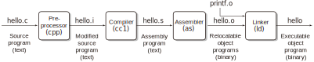
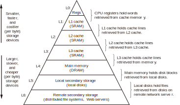

# CSAPP Notes

*CSAPP* stands for *Computer Systems: A Programmer's Perspective*.

Be aware that the notes here are not linearly organized. And this should not be a substitute for the book.

## 1.2 Programs Are Translated by Other Programs into Different Forms

### Compilation System

For a typical C program `hello.c`:

```c
#include<stdio.h>

int main() {
    printf("hello, world\n");
    return 0;
}
```

When running

```sh
gcc -o hello hello.c
```

Four phases are performed:



 - **Preprocessing phase**: The preprocessor (`cpp`) turns `hello.c` to `hello.i`. The result `hello.i` is also a C program. In this phase, `#include<stdio.h>` is replaced by the content of `stdio.h`.
 - **Compilation phase**: The compiler (`cc1`) translates text file `hello.i` into text file `hello.s`, which contains an *assembly-language program*.
 - **Assembly phase**: The assembler (`as`) translates `hello.s` into machine-language instructions, packages them in a form known as a *relocatable object program*, and stores the result in the object file `hello.o`.
 - **Linking phase**. Take `printf` function for example. The `printf` function resides in a separate precompiled object file called `printf.o`, which must be merged with `hello.o`. The linker (`ld`) handles this merging. The result is the *executable object file* `hello`.

---

## 1.4 Processors Read and Interpret Instructions Stored in Memory

### Hardware Organization of a System


 - **Word**: The natural unit of access for a processor. A word is typically 4 bytes or 8 bytes long. A *bus* transfers a word at a time.
 - **I/O Devices :: Controller / Adapter**: *Controllers* are chip set in the device itself or on the motherboard. An *adapter* is a card that plugs into a slot on the motherboard.
 - **CPU :: PC / ALU**: *PC* stands for *program counter*, *ALU* stands for *arithmetic/logic unit*.

---

## 1.6 Storage Devices Form a Hierarchy

> This notion of inserting a smaller, faster storage device (e.g., cache memory) between the processor and a larger, slower device (e.g., main memory) turns out to be a general idea.

Memory hierarchy:



---

## 1.7 The Operating System Manages the Hardware

The operating system manages the hardware by providing abstractions for the hardware resources.


 - **File**: I/O devices.
 - **Virtual memory**: Main memory and I/O devices.
 - **Processes**: The processor, main memory, and I/O devices.

### Processes

> When a program such as `hello` runs on a modern system, the operating system provides the illusion that the program is the only one running on the system. The program appears to have exclusive use of both the processor, main memory, and I/O devices. The processor appears to execute the instructions in the program, one after the other, without interruption. And the code and data of the program appear to be the only objects in the system’s memory. These illusions are provided by the notion of a process, one of the most important and successful ideas in computer science.

Multiple processes run concurrently on a system.

> **Kernel**: The *kernel* is the portion of the operating system code that is always resident in memory. When an application program requires some action by the operating system, such as to read or write a file, it executes a special system call instruction, transferring control to the kernel. The kernel then performs the requested operation and returns to the application program.

### Threads

Multiple threads run concurrently within a process.

They share the same code and global data.

### Virtual Memory

An abstraction that provides each process with the illusion that it has exclusive use of the main memory.

### Files

Every I/O device, e.g., disks, keyboards, and monitors, is modeled as a file.

---

## 1.9 Important Themes

### Amdahl's Law

Consider a system in which executing some application requires time $T_{\text{old}}$. Suppose some part of the system requires a fraction $\alpha$ of this time, and that we improve its performance by a factor of $k$. The overall execution time would thus be

$$
\begin{aligned}
T_{\text{new}}=&(1-\alpha)T_{\text{old}} + \alpha T_{\text{old}}/k\\
=&T_{\text{old}}[(1-\alpha) + \alpha/k]
\end{aligned}
$$

The speedup $S = T_{\text{old}} / T_{\text{new}}$ is

$$S=\frac{1}{(1-\alpha) + \alpha/k}$$

Suppose we significantly improved a part that takes $60%$ of the time by a factor of $3$. The speedup is only $1.67\times$. The overall improvement is not as good as we expected.

Furthermore, suppose we are able to take some part of the system and speed it up to the point at which it takes a negligible amount of time. That is, we set $k$ to $\infty$. The speedup is

$$S_\infty=\frac{1}{1-\alpha}$$

When we set $\alpha$ to $60\%$, the speedup is only $2.5\times$.

**Conclude**: To significantly improve the overall performance of a system, we must improve the speed of a very large fraction of the system.